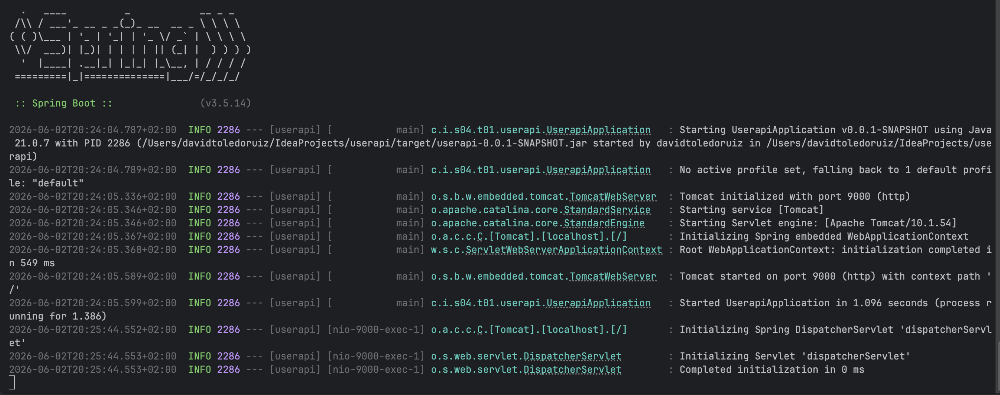

# S4.01 - User API

Introduction to Spring Boot and REST APIs.

## Level 1 - Health Check API

## Description

This project exposes a simple REST endpoint to verify that the API is running correctly.

## Technologies

- Java 21
- Spring Boot 3.5.14
- Maven
- JUnit 5
- MockMvc

## Endpoint

### GET /health

Returns the health status of the API.

Example response:

```json
{
  "status": "OK"
}
```

## Testing

The project includes automated tests using MockMvc to verify:

- HTTP 200 OK response
- Correct JSON structure
- Expected value of the `status` field

## JAR Execution

The application was successfully packaged and executed as a standalone JAR file.



## Level 2

To be implemented in the next stage of the assignment.

## Author

David Toledo